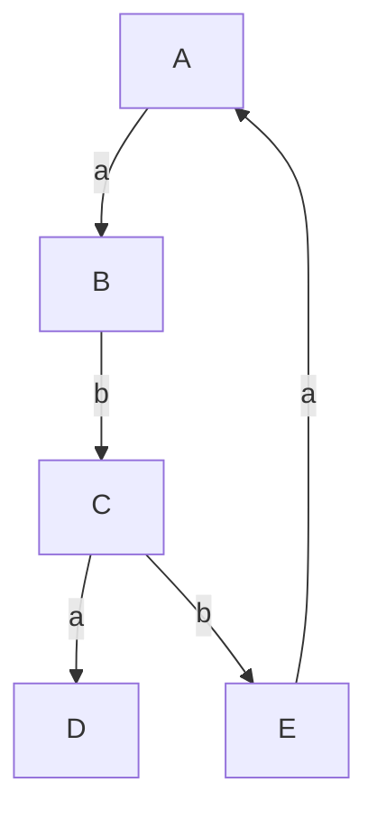
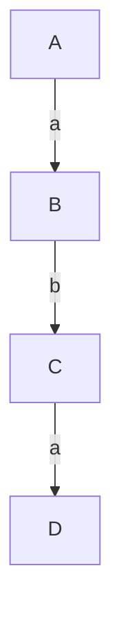

# Trabalho da matéria: Linguagens de Programação

Alunos: Dario Mousinho e João Guilherme Beltrão

## Descrição:
Implementar um programa em Haskell que receba como entrada um frame PDL (i.e. um grafo com arestas rotuladas) F = (W, Rα) tal que W é um conjunto de estados (vértices) e Rα é uma relação binária indexada (arestas rotuladas) e um programa PDL π. A saída deverá ser o resultado da verificação de se F corresponde a um frame válido para π, isto é, se F é um grafo induzido por π. Caso a resposta seja negativa, uma mensagem de erro deve explicitar o ponto de incompatibilidade.

---- 

## Como executar o passo a passo do programa?

- 1ª entrada deverá prover os vértices do frame PDL, estes serão a partir de uma única linha, por exemplo: "A B C D" seriam os vértices(estados) para o programa.
- 2ª entrada deverá prover as relações que se dão por "A B α", desta forma para cada relação será digitado a partir de uma nova linha, assim que não tiver mais relações para inputar pode enviar uma linha vazia.
- 3ª entrada deverá fornecer a fórmula PDL, na qual conterá os seguintes operadores ";" "U" "*" "?" no corpo do programa (string).

## Exemplo de execução
- Quais são os vértices?
 - "A B C D E"
- Quais são as relações existentes?
 - A B a
 - B C b
 - C D a
 - C E b
 - E A a

- Com estas informações temos o frame:

- Agora tendo uma entrada do tipo (a;b;a)U(b;b;b), verificamos que é executável pois:

#### Observação: isso tomando como estado inicial o A. Em nosso código tomamos como estado inicial o primeiro vértice inputado.

